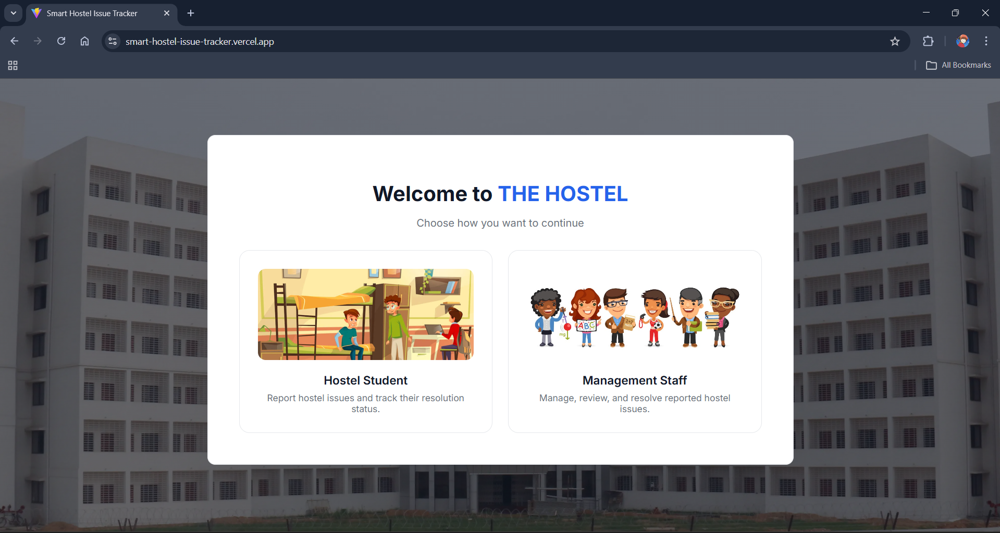
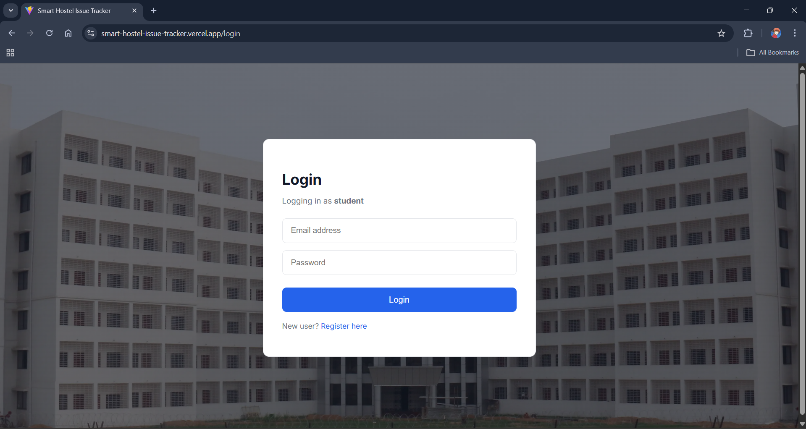
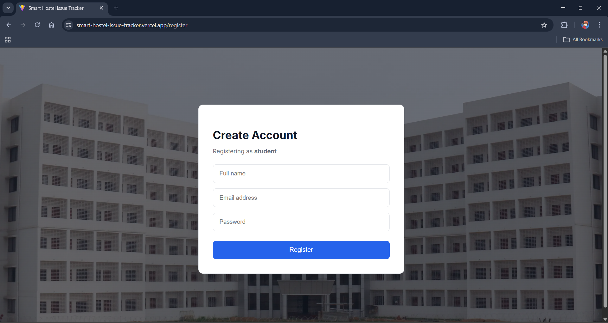
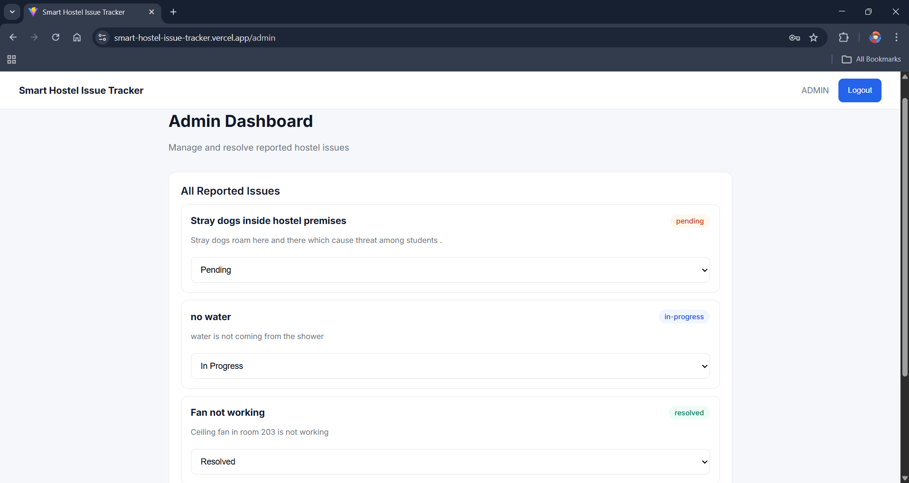
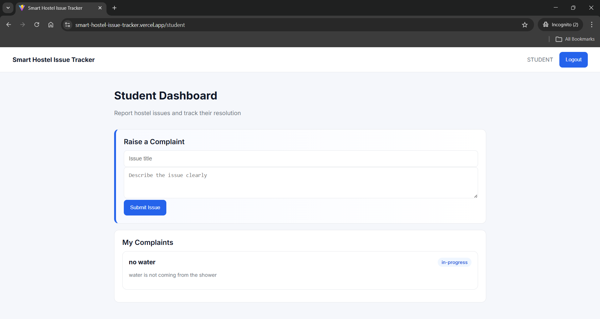

# Problem Statement

**Digital Hostel Issue Management System**

In most hostels, infrastructure and maintenance issues are reported through informal channels such as verbal complaints, WhatsApp groups, or manual registers. These methods lack tracking, accountability, transparency, and often lead to delayed or ignored resolutions.

The goal of this project is to design and implement a **centralized, transparent, and role‑based digital platform** that allows students to report hostel issues and enables hostel management to track, manage, and resolve them efficiently.

---

# Project Name

**Smart Hostel Issue Tracker**

---

# Team Name

**NewHack**

---

# Deployed Link

**https://smart-hostel-issue-tracker.vercel.app**

- Frontend is deployed on Vercel and is connected with the backend
- Backend is deployed on Render using MongoDB Atlas

---


## Project Overview

**Smart Hostel Issue Tracker** is a role‑based web platform designed to digitize hostel issue reporting and resolution.

The system replaces unstructured complaint methods with a structured workflow where:
- Students can submit and track issues
- Hostel management can view, update, and resolve complaints
- Status updates are visible in real time

The platform ensures **transparency, accountability, and faster resolution** of hostel‑related problems.

---

## User Roles Implemented

### 1️. Student
- Register and log in securely
- Raise hostel issues (plumbing, electricity, cleanliness, etc.)
- View all submitted complaints
- Track issue status:
  - Pending
  - In Progress
  - Resolved

---

### 2️. Hostel Management (Admin)
- Secure admin login
- View all reported issues
- Update issue status
- Monitor complaint resolution workflow
- Ensure accountability and transparency

---

## Application Flow

1. **Step 1:** User selects role (Student / Management)
2. **Step 2:** User registers or logs in
3. **Step 3:** Student submits a hostel issue
4. **Step 4:** Admin reviews the issue
5. **Step 5:** Admin updates issue status
6. **Step 6:** Student sees real‑time status update

---

##  Key Features

### Core Issue Management
- Secure issue reporting system
- Role‑based dashboards
- Real‑time status tracking
- Clean and intuitive UI

### Authentication & Authorization
- JWT‑based authentication
- Role‑based access control
- Protected backend routes

### Transparency & Accountability
- Students can track every complaint
- Admin actions are reflected instantly
- No issue is lost or ignored

---

## Tech Stack

### Frontend
- React (Vite)
- TypeScript
- Axios
- CSS (Custom UI)

### Backend
- Node.js
- Express.js
- MongoDB Atlas
- Mongoose
- JWT Authentication

---

## Setup & Installation

###  Clone Repository
```bash
git clone https://github.com/hsahu1726/smart-hostel-issue-tracker.git
cd smart-hostel-issue-tracker
```
--- 

###  Backend Setup
```bash
cd backend
npm install
```
Run backend (development mode):
```bash
npm run dev
```
Backend will run on:
```bash
http://localhost:5000
```
---

###  Backend Environment Variables
Create a .env file inside the backend folder:
```bash
touch .env
```
Add the following to .env:
```bash
PORT=5000
MONGO_URI=mongodb+srv://<username>:<password>@cluster0.mongodb.net/hostel
JWT_SECRET=your_secret_key
```
---

###  Frontend Setup
```bash
cd ../frontend
npm install
```
Run frontend:
```bash
npm run dev
```
Frontend will run on:
```bash
http://localhost:5173
```
---

###  Frontend Environment Variables
If using environment‑based API URL, create .env in frontend:
```bash
touch .env
```
Add:
```bash
VITE_API_URL=http://localhost:5000/api
```
For production:
```bash
VITE_API_URL=https://<your-backend>.onrender.com/api
```
---

###  Build Frontend for Production
```bash
npm run build
```
---

###  Preview Production Build
```bash
npm run preview
```
---

###  Common Commands Summary
```bash
# Start backend
cd backend && npm run dev

# Start frontend
cd frontend && npm run dev
```

---

###  Stop All Running Servers
```bash
CTRL + C
```
---

##  API Endpoints

### Create Issue (Student)
```bash
POST /api/issues
```
Request Body:
```bash
{
  "title": <title_of_your_issue>,
  "description": <desc_of_your_issue>
}
```
---

### Get Student Issues
```bash
GET /api/issues/my
```
---

### Get All Issues (Admin)
```bash
GET /api/issues
```
---

### Update Issue Status (Admin)
```bash
PUT /api/issues/:id
```
---

##  Future Enhancements
- Issue categorization and priority levels
- Image and media uploads
- Analytics dashboard for hostel management
- Notification system (email / push)
- Lost & Found module
- Multi‑hostel and multi‑block support

---

##  Conclusion
Smart Hostel Issue Tracker provides a practical, scalable, and transparent solution for managing hostel infrastructure issues.
It improves accountability, reduces response time, and enhances communication between students and hostel authorities.

---

##  Application Screenshots

###  Landing Page


---

###  Login Page


---

###  Registration Page


---

###  Admin Dashboard


---

###  Student Dashboard


---

